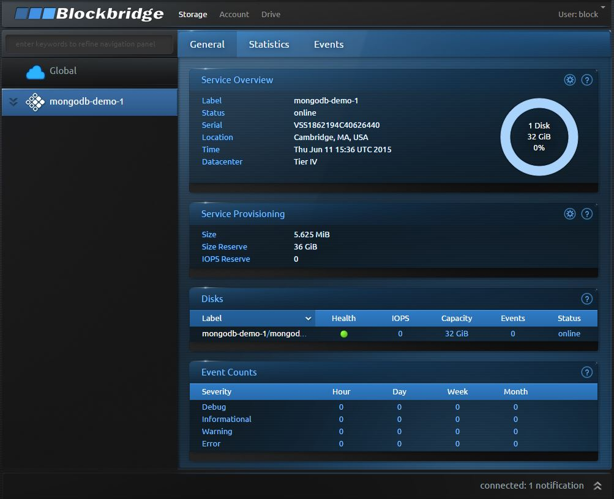
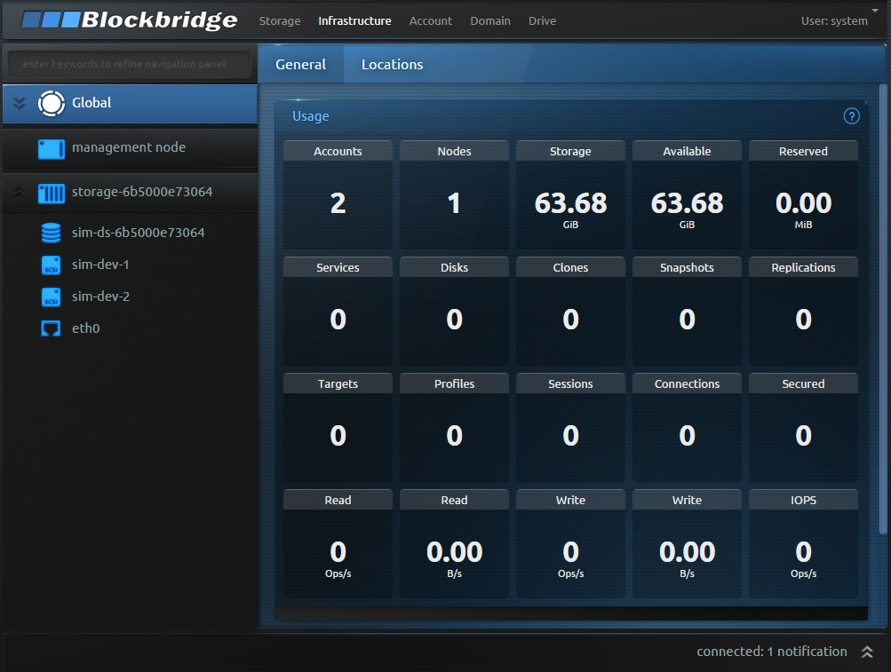
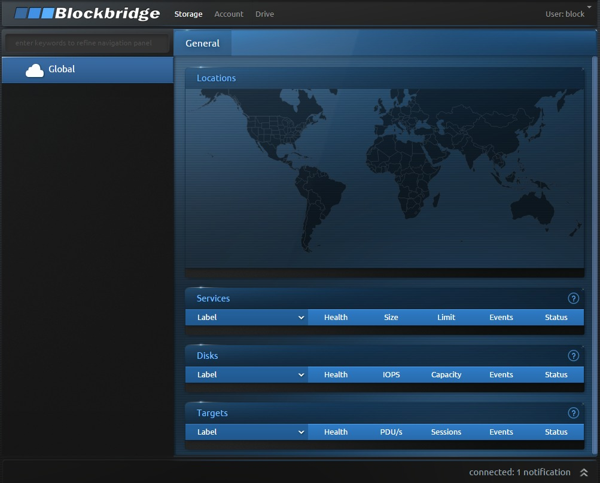

Blockbridge EPS Simulator
=========================

The Blockbridge simulator makes it easy to try Elastic Programmable Storage
(EPS) in a non-production environment. Blockbridge software transforms
commodity and/or existing legacy infrastructure into secure multi-tenant
storage that operates as a programmable service. Blockbridge provides automatic
encryption, secure deletion, quality of service, secure replication, transport
security and data exfiltration detection on your choice of hardware/storage.



## Installation

The Blockbridge EPS simulator is available as a set of Docker containers.  To
install, simply clone the Blockbridge demo repository from GitHub.

```bash
git clone https://github.com/blockbridge/blockbridge-demo.git
cd blockbridge-demo
```

## Getting Started

The easiest way to get started is to deploy a two-node simulator, with either
private container networking or public networking (to access simulator from a
remote host). In the two-node configuration, one node is responsible for API
access and hosting the web application, while the other node hosts the storage
services.

With only one IP address on the host, the run script will auto-detect it and
program things accordingly:

```
$ ./simulator/complete_two_node/run_public.sh 
Starting management node (using 172.16.5.193): 649050292d12e48c92f56a8bf8c3e97b248d9a5d33a5172a7b9cd8ac3f75f1a9
Starting storage node (using 172.16.5.193): 3bf832073934857a18b38bf7d2f53d95424f6a7dee7ea8c9661dcc73cd5e8109
```

For private networking, the containers are linked through the Docker network:

```
$ ./simulator/complete_two_node/run_private.sh 
Starting management node: 13157c64db0175170ee2b83ae626ec36b444e48b8e24b9e5ebe06f4...
Starting storage node: 9a42763757c06e275c03ed5f195c0cbbc43f7e7eeb4137e388057ff38d026b73
```

### Access the Management Application
 
After the management node boots for the first time, it randomly generates a set
of access credentials for both a storage administrator and a tenant user, then
prints them to the container logs. You'll need these to manage the simulator.
Retrieve them credentials now with the `docker logs bbsim-mn` command.

```
$ docker logs bbsim-mn
-- running in container
Setting default management configuration...
'/bb/etc/sim-mncfg.lua' -> '/bb/etc/mncfg.lua'
Generating node TLS key and self-signed certificate: done.
Starting Blockbridge simulator node:1
...

==============================================
Blockbridge simulator (container) has started.

Mode:            management
Management node: management-649050292d12
IP Address:      172.16.5.193
Admin API Key:   1/+q3MIScHrz5NqZ5Xwp+AJN3RoveHunlxabeg05Qy4XTqrcwhJweufw
Admin account:   system
Admin password:  576b3c43fefb35be49cf1f9228044647
User account:    block
User password:   5d11f6670c0c1ffa132c516a8bcf4f3a

==============================================
```

Next, connect to the storage administrator account `system` with the management
web application. Simply point your web browser at the IP address of the host
running the management node. After accepting the certificate, sign in at the
Blockbridge login prompt with the `system` account and its generated password
from the `Admin password` line above.  The administrator view looks like this:



This is the **Global** section of the **Infrastructure** side of the web
application.  It presents a summary of the storage provisioned to the simulator
(about 64 GiB in this example).  From this interface, you can define the pool of
physical storage devices, create other accounts and users, and configure
numerous other system-wide parameters.

Secure storage tenants are completely isolated from the details of the
Infrastructure part of the application -- and they're completely isolated from
each other's storage.  To see a tenant view, log out of the administrator
account by selecting **User: system** from the top bar, then **Logout**.  Sign
back in as the `block` user with the `User password` from the prior section.
You'll see a screen like this:



This is the **Global** section of the **Storage** side of the web application,
where tenants manage their provisioned storage.  It's empty -- this tenant has
no storage provisioned yet!

## What's next?

* [Configure the simulator](simulator/README.md) with more storage nodes or
  different configurations.
* [Explore the CLI tool](cli/README.md) running as a Docker container.
* [Use docker volumes with the Blockbridge volume plugin for Docker](https://github.com/blockbridge/blockbridge-docker-volume)
